# Objective Judge Horizon (OJH) report

Written by OJH 0.2.0 on 2026-09-15 19:12 from 13 result file(s) covering 5 game(s). Measured: turn speed for 5, frame rate for 4, network for 4 and footprint for 0.

## At a glance

Games in order of their OJH score. Firsts and lasts count the statistics below on which a game came best or worst of the games measured for it; a statistic only one game has is not counted. Went best and went worst name the statistic where the game stood furthest ahead or behind.

| Game | OJH score | Firsts | Lasts | Went best | Went worst |
|---|---|---|---|---|---|
| Open Doctrines | 2,656 | 13 | 0 | Slowest turn: 0.133 s, 1st of 5 | 1% low frame rate: 150.3 fps, 2nd of 3 |
| Unciv | 1,994 | 13 | 0 | While a turn resolves: 1,782 fps, 1st of 2 | Late-game slowdown: 2.73x, 4th of 5 |
| Freeciv | 1,598 (provisional) | 3 | 1 | Turn delivery time: 0.0001 s, 1st of 2 | Highest data per turn per player: 8.21 KiB, 2nd of 2 |
| FreeCol (version 1.2.0) | 666 | 0 | 2 | Region-turns per minute: 231,577 region-turns/min, 3rd of 5 | Late-game slowdown: 11.54x, 5th of 5 |
| Greater Diplomacy 5 | 507 | 1 | 27 | Late-game slowdown: 1.09x, 1st of 5 | Turn delivery time: 0.145 s, 2nd of 2 |

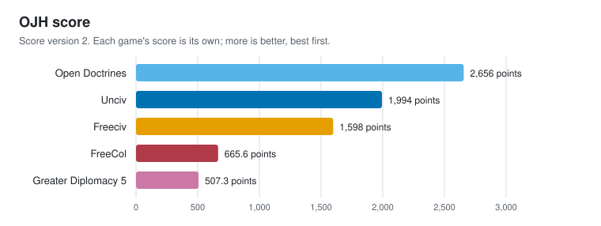

## What went best and what went worst

### For every statistic

| Statistic | Better when | Best | Worst | Best vs worst |
|---|---|---|---|---|
| Turns per minute | more | Open Doctrines, 615.2 turns/min | Greater Diplomacy 5, 4.12 turns/min | 149.3x more |
| Player-turns per minute | more | Open Doctrines, 38,761 player-turns/min | Greater Diplomacy 5, 259.8 player-turns/min | 149.2x more |
| Region-turns per minute | more | Open Doctrines, 798,593 region-turns/min | Greater Diplomacy 5, 9,134 region-turns/min | 87.4x more |
| Turns per minute, slowest run | more | Open Doctrines, 615.2 turns/min | Greater Diplomacy 5, 4.12 turns/min | 149.3x more |
| Median turn | less | Open Doctrines, 0.0961 s | Greater Diplomacy 5, 14.9 s | 155.6x less |
| Slow turn (95th percentile) | less | Open Doctrines, 0.119 s | Greater Diplomacy 5, 18.7 s | 157.4x less |
| Slowest turn | less | Open Doctrines, 0.133 s | Greater Diplomacy 5, 20.6 s | 154.3x less |
| Late-game slowdown | less | Greater Diplomacy 5, 1.09x | FreeCol, 11.54x | 10.6x less |
| Start-up | less | Unciv, 0.898 s | Greater Diplomacy 5, 16.6 s | 18.5x less |
| Peak memory | less | Freeciv, 87.7 MiB | Greater Diplomacy 5, 3.63 GiB | 42.3x less |
| Memory per player | less | Freeciv, 1.39 MiB | FreeCol, 79.2 MiB | 56.9x less |
| CPU time per turn | less | Open Doctrines, 0.0973 s | Greater Diplomacy 5, 14.1 s | 145.0x less |
| CPU time per player-turn | less | Open Doctrines, 0.0015 s | Greater Diplomacy 5, 0.224 s | 145.0x less |
| Frame rate on the map | more | Unciv, 1,570 fps | Greater Diplomacy 5, 101.8 fps | 15.4x more |
| 1% low frame rate | more | Unciv, 248.8 fps | Greater Diplomacy 5, 6.82 fps | 36.5x more |
| Slow frame (99th percentile) | less | Unciv, 0.0034 s | Greater Diplomacy 5, 0.0328 s | 9.7x less |
| Main menu | more | Unciv, 1,907 fps | Greater Diplomacy 5, 296.5 fps | 6.4x more |
| Map, start of game | more | Unciv, 1,469 fps | Greater Diplomacy 5, 101.8 fps | 14.4x more |
| Map, zoomed out | more | Unciv, 1,637 fps | Greater Diplomacy 5, 102.3 fps | 16.0x more |
| Map, zoomed in | more | Unciv, 1,546 fps | Greater Diplomacy 5, 130.9 fps | 11.8x more |
| Map, scrolling | more | Unciv, 1,570 fps | Greater Diplomacy 5, 101.1 fps | 15.5x more |
| Heaviest panel | more | Unciv, 1,201 fps | Greater Diplomacy 5, 106.5 fps | 11.3x more |
| Map, late game | more | Unciv, 1,623 fps | Greater Diplomacy 5, 97.69 fps | 16.6x more |
| While a turn resolves | more | Unciv, 1,782 fps | Greater Diplomacy 5, 109.8 fps | 16.2x more |
| Data per turn, highest | less | Open Doctrines, 36.6 KiB | Greater Diplomacy 5, 48.6 MiB | 1359.1x less |
| Data per turn, median | less | Open Doctrines, 35.7 KiB | Greater Diplomacy 5, 23.4 MiB | 672.2x less |
| Data per turn, lowest | less | Open Doctrines, 31.0 KiB | Greater Diplomacy 5, 22.5 MiB | 743.8x less |
| Highest data per turn per player | less | Unciv, 2.56 KiB | Freeciv, 8.21 KiB | 3.2x less |
| Turn delivery time | less | Freeciv, 0.0001 s | Greater Diplomacy 5, 0.145 s | 2894.8x less |
| Busiest second | less | Open Doctrines, 449 KiB | Greater Diplomacy 5, 61.3 MiB | 139.7x less |

### For every game

- **Open Doctrines**: went best at Slowest turn: 0.133 s, 1st of 5; CPU time per player-turn: 0.0015 s, 1st of 5; CPU time per turn: 0.0973 s, 1st of 5. Went worst at nothing (no last places).
- **Unciv**: went best at While a turn resolves: 1,782 fps, 1st of 2; Map, zoomed out: 1,637 fps, 1st of 3; Map, start of game: 1,469 fps, 1st of 3. Went worst at nothing (no last places).
- **Freeciv**: went best at Turn delivery time: 0.0001 s, 1st of 2; Peak memory: 87.7 MiB, 1st of 5; Memory per player: 1.39 MiB, 1st of 5. Went worst at Highest data per turn per player: 8.21 KiB, 2nd of 2.
- **FreeCol (version 1.2.0)**: went best at nothing (no first places). Went worst at Late-game slowdown: 11.54x, 5th of 5; Memory per player: 79.2 MiB, 5th of 5.
- **Greater Diplomacy 5**: went best at Late-game slowdown: 1.09x, 1st of 5. Went worst at Turn delivery time: 0.145 s, 2nd of 2; Data per turn, highest: 48.6 MiB, 4th of 4; Data per turn, lowest: 22.5 MiB, 4th of 4.

## Machine

| Part | This machine |
|---|---|
| OS | macOS 26.3 (25D125) |
| Model | MacBookPro18,1 |
| CPU | Apple M1 Pro |
| Logical CPUs | 10 (8 performance, 2 efficiency) |
| Memory | 16.0 GiB |
| GPU | Apple M1 Pro (16 cores) |
| Display | 3456 x 2234 Retina |
| Power | mains |
| CPU reference score | 1,724 rounds/s on one core, 12,610 on all cores |

The reference score is OJH's own fixed CPU workload (src/machine.c), timed on this machine. Divide a result by it to compare across hardware.

## OJH scores

Each game's score is its own: it is built from that game's result files alone, against fixed reference levels, so no game's score depends on which other games are in this report. Each scorecard next to this report shows every part, and has a badge (.svg) to go with it.

| Game | OJH score | Coverage | Status | Scorecard |
|---|---|---|---|---|
| Open Doctrines | 2,656 | 96% | final | score-opendoctrines.md |
| Unciv | 1,994 | 96% | final | score-unciv.md |
| Freeciv | 1,598 | 80% | provisional | score-freeciv.md |
| FreeCol (version 1.2.0) | 666 | 67% | final | score-freecol.md |
| Greater Diplomacy 5 | 507 | 100% | final | score-gd5.md |

A provisional score comes from a run too short or incomplete to stand behind; its scorecard says why. Measure again before publishing it.

## Turn speed

How fast each game plays its turns with every player run by its own AI. Start-up and world generation are timed separately and are not part of the turns. Player-turns and region-turns multiply turn speed by the size of the game, so a larger game is not punished for its size.

| Game | Turns per minute | Player-turns per minute | Region-turns per minute | Turns per minute, slowest run | Median turn | Slow turn (95th percentile) | Slowest turn | Late-game slowdown | Start-up | Players | Map regions |
|---|---|---|---|---|---|---|---|---|---|---|---|
| Open Doctrines | 615.2 turns/min (1st) | 38,761 player-turns/min (1st) | 798,593 region-turns/min (1st) | 615.2 turns/min (1st) | 0.0961 s (1st) | 0.119 s (1st) | 0.133 s (1st) | 1.17x (2nd) | 1.034 s (3rd) | 63 | 1,298 |
| Unciv | 143.4 turns/min (2nd) | 9,031 player-turns/min (2nd) | 400,105 region-turns/min (2nd) | 143.4 turns/min (2nd) | 0.396 s (2nd) | 0.744 s (2nd) | 1.129 s (2nd) | 2.73x (4th) | 0.898 s (1st) | 63 | 2,791 |
| FreeCol | 40.20 turns/min (3rd) | 643.3 player-turns/min (4th) | 231,577 region-turns/min (3rd) | 40.20 turns/min (3rd) | 1.288 s (3rd) | 3.729 s (3rd) | 5.283 s (3rd) | 11.54x (5th) | 1.456 s (4th) | 16 | 5,760 |
| Freeciv | 27.85 turns/min (4th) | 1,755 player-turns/min (3rd) | 107,845 region-turns/min (4th) | 27.85 turns/min (4th) | 2.052 s (4th) | 5.100 s (4th) | 6.576 s (4th) | 2.21x (3rd) | 0.999 s (2nd) | 63 | 3,872 |
| Greater Diplomacy 5 | 4.12 turns/min (5th) | 259.8 player-turns/min (5th) | 9,134 region-turns/min (5th) | 4.12 turns/min (5th) | 14.9 s (5th) | 18.7 s (5th) | 20.6 s (5th) | 1.09x (1st) | 16.6 s (5th) | 63 | 2,215 |

Places are in brackets: 1st is the best of the games measured for that statistic. A statistic that is not ranked (players, map size, cores in use, information per minute) is context: more of it is neither better nor worse on its own.

### Graphs

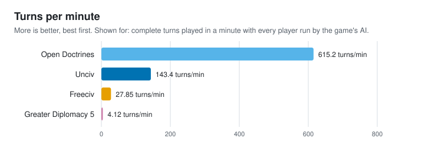

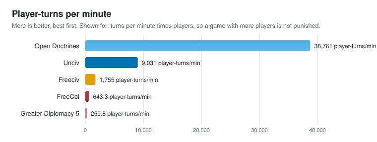

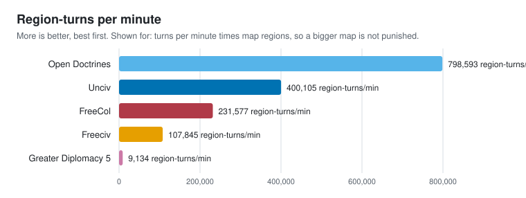

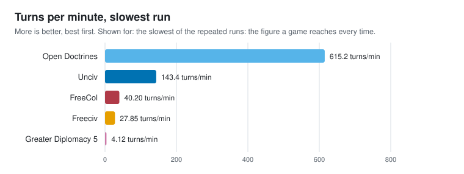

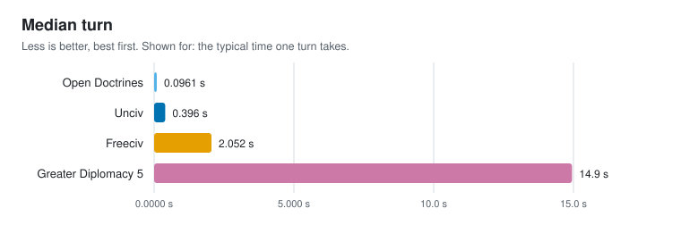

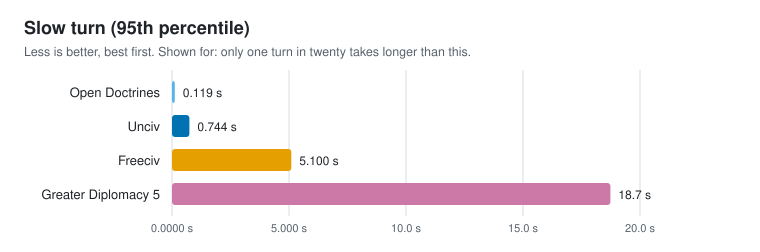

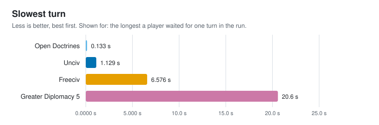

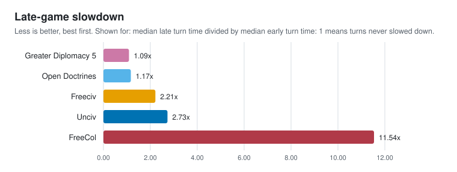

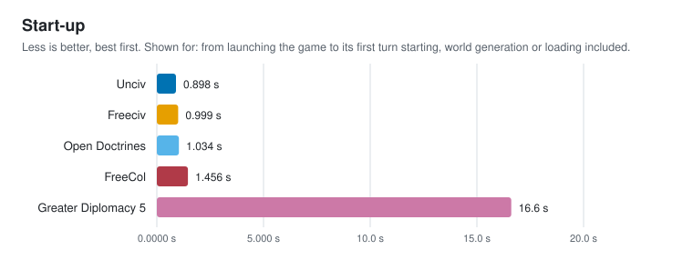

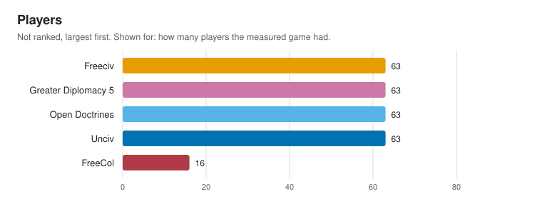

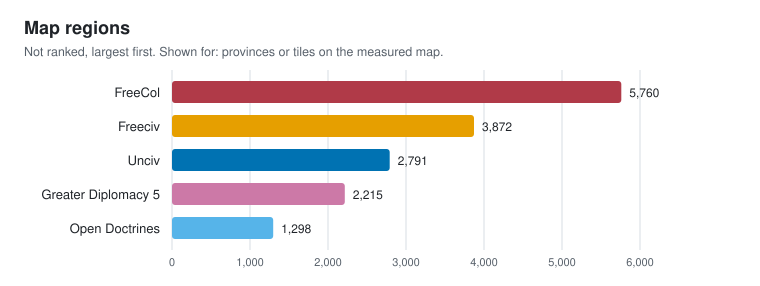

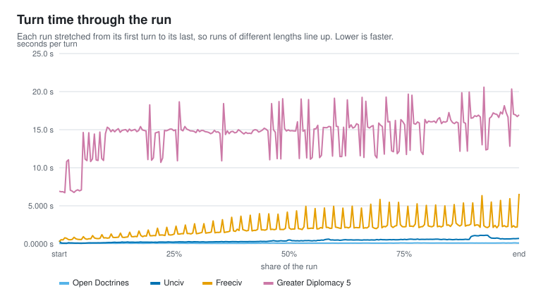

### What each statistic means

- **Turns per minute**: complete turns played in a minute with every player run by the game's AI. More is better.
- **Player-turns per minute**: turns per minute times players, so a game with more players is not punished. More is better.
- **Region-turns per minute**: turns per minute times map regions, so a bigger map is not punished. More is better.
- **Turns per minute, slowest run**: the slowest of the repeated runs: the figure a game reaches every time. More is better.
- **Median turn**: the typical time one turn takes. Less is better.
- **Slow turn (95th percentile)**: only one turn in twenty takes longer than this. Less is better.
- **Slowest turn**: the longest a player waited for one turn in the run. Less is better.
- **Late-game slowdown**: median late turn time divided by median early turn time: 1 means turns never slowed down. Less is better.
- **Start-up**: from launching the game to its first turn starting, world generation or loading included. Less is better.
- **Players**: how many players the measured game had. Not ranked.
- **Map regions**: provinces or tiles on the measured map. Not ranked.

### How each game was timed

- **Open Doctrines**: Open Doctrines' own OJH turn lines (OD_OJH=1): processTurn timed turn by turn inside the headless eval, 250 turns. Asked for 250 turns, seed 20260914, players as the game's own scenario or world sets them.
- **Unciv**: OJH's Unciv driver times each GameInfo.nextTurn call (250 turns). Asked for 250 turns, seed 20260914, 63 players, chosen by OJH.
- **FreeCol**: FreeCol's own "OJH turn" lines, the gaps between them (250 turns timed of 250 turn lines). Asked for 250 turns, seed 20260914, players as the game's own scenario or world sets them.
- **Freeciv**: gaps between Freeciv's per-turn "End/start-turn server/ai activities" log lines (249 turns timed of 250 markers). Asked for 250 turns, seed 20260914, 63 players, chosen by OJH.
- **Greater Diplomacy 5**: Greater Diplomacy 5's own map_tools/ojh_benchmark.py: every turn through turn_manager, AI preparation, resolution and the map refresh, every nation AI, model diplomacy skipped (250 turns). Asked for 250 turns, seed 20260914, players as the game's own scenario or world sets them.

### Before comparing these numbers

- **Run length**: The runs timed different numbers of turns (249 to 250). Turns get slower as a game goes on, so a shorter run reads faster: compare runs of the same length.
- **Game size**: Player counts differ (16 to 63), and so do map sizes. The player-turn and region-turn figures account for size, not for rules or how much thinking each AI does.
- **Scope**: Every number comes from one machine under the fairness rules in README.md. None of it is a claim about other hardware.

## CPU and memory

What the game cost the machine while it played those turns, sampled ten times a second over the game and every process it started.

| Game | Peak memory | Memory per player | CPU time per turn | CPU time per player-turn | Cores in use |
|---|---|---|---|---|---|
| Freeciv | 87.7 MiB (1st) | 1.39 MiB (1st) | 2.147 s (4th) | 0.0341 s (3rd) | 1 cores |
| Open Doctrines | 559 MiB (2nd) | 8.87 MiB (2nd) | 0.0973 s (1st) | 0.0015 s (1st) | 1 cores |
| Unciv | 1.18 GiB (3rd) | 19.1 MiB (3rd) | 0.739 s (2nd) | 0.0117 s (2nd) | 1.36 cores |
| FreeCol | 1.24 GiB (4th) | 79.2 MiB (5th) | 1.572 s (3rd) | 0.0983 s (4th) | 1.02 cores |
| Greater Diplomacy 5 | 3.63 GiB (5th) | 58.9 MiB (4th) | 14.1 s (5th) | 0.224 s (5th) | 0.990 cores |

Places are in brackets: 1st is the best of the games measured for that statistic. A statistic that is not ranked (players, map size, cores in use, information per minute) is context: more of it is neither better nor worse on its own.

### Graphs

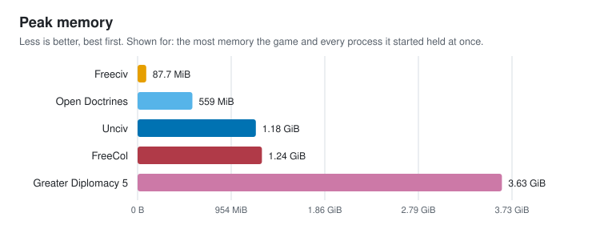

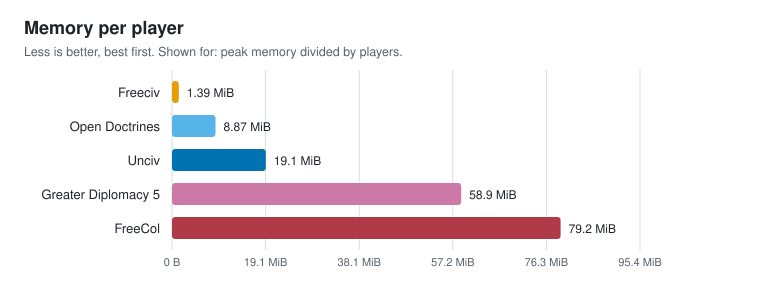

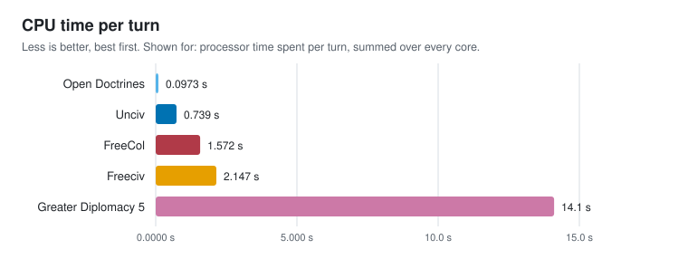

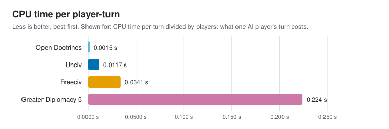

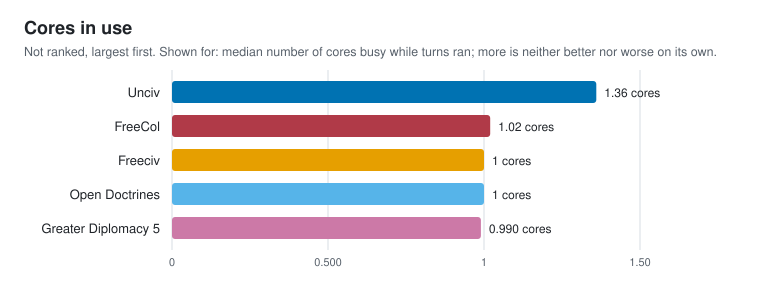

### What each statistic means

- **Peak memory**: the most memory the game and every process it started held at once. Less is better.
- **Memory per player**: peak memory divided by players. Less is better.
- **CPU time per turn**: processor time spent per turn, summed over every core. Less is better.
- **CPU time per player-turn**: CPU time per turn divided by players: what one AI player's turn costs. Less is better.
- **Cores in use**: median number of cores busy while turns ran; more is neither better nor worse on its own. Not ranked.

## Frame rate

Frames per second in the same scenes in every game, with frame caps and vsync off where the game allows it. A scene a game does not have is n/a.

| Game | Frame rate on the map | 1% low frame rate | Slow frame (99th percentile) | Main menu | Map, start of game | Map, zoomed out | Map, zoomed in | Map, scrolling | Heaviest panel | Map, late game | While a turn resolves |
|---|---|---|---|---|---|---|---|---|---|---|---|
| Unciv | 1,570 fps (1st) | 248.8 fps (1st) | 0.0034 s (1st) | 1,907 fps (1st) | 1,469 fps (1st) | 1,637 fps (1st) | 1,546 fps (1st) | 1,570 fps (1st) | 1,201 fps (1st) | 1,623 fps (1st) | 1,782 fps (1st) |
| Open Doctrines | 620.9 fps (2nd) | 150.3 fps (2nd) | 0.0053 s (2nd) | 1,188 fps (2nd) | 345.8 fps (2nd) | 351.0 fps (2nd) | 675.4 fps (2nd) | 650.5 fps (2nd) | 562.9 fps (2nd) | 620.9 fps (2nd) | n/a |
| Greater Diplomacy 5 | 101.8 fps (3rd) | 6.82 fps (3rd) | 0.0328 s (3rd) | 296.5 fps (3rd) | 101.8 fps (3rd) | 102.3 fps (3rd) | 130.9 fps (3rd) | 101.1 fps (3rd) | 106.5 fps (3rd) | 97.69 fps (3rd) | 109.8 fps (2nd) |
| Freeciv | n/a | n/a | n/a | n/a | n/a | n/a | n/a | n/a | n/a | n/a | n/a |

Places are in brackets: 1st is the best of the games measured for that statistic. A statistic that is not ranked (players, map size, cores in use, information per minute) is context: more of it is neither better nor worse on its own.

### Graphs

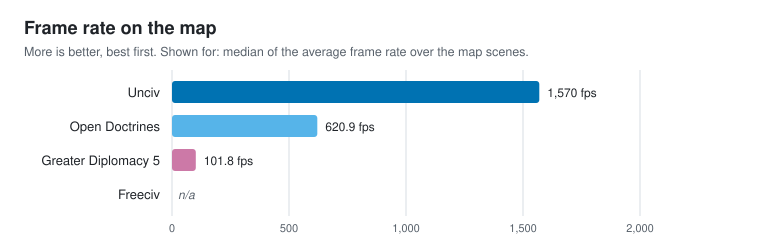

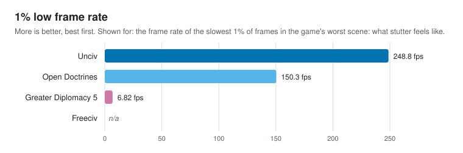

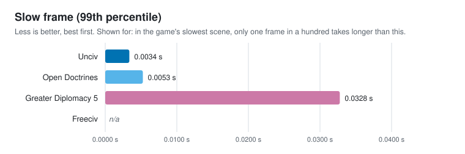

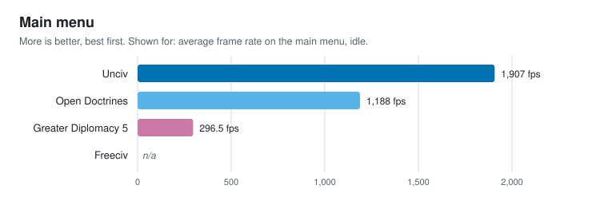

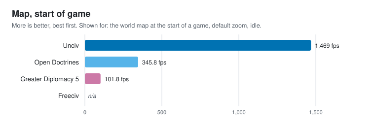

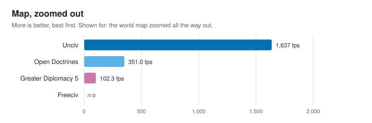

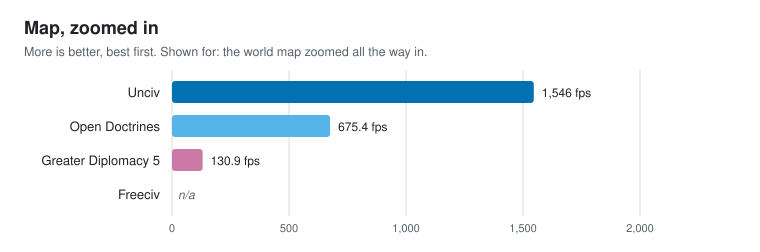

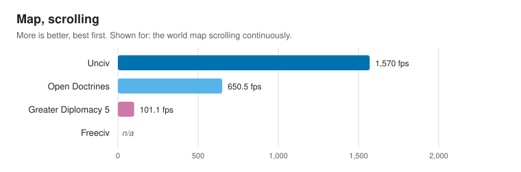

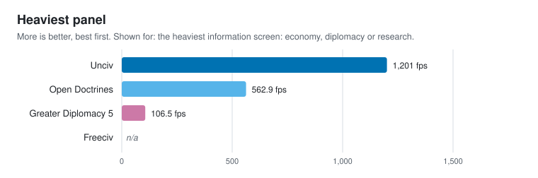

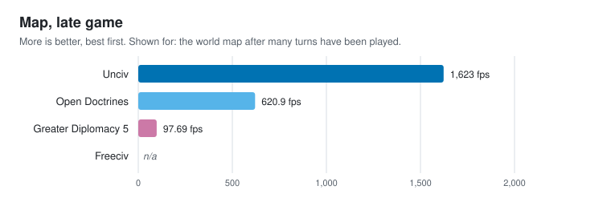

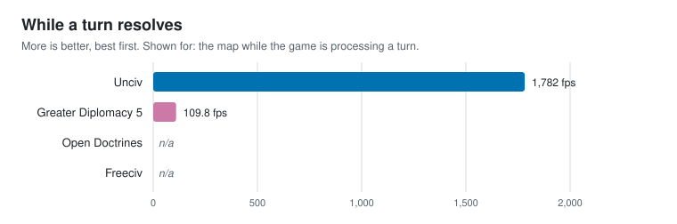

### What each statistic means

- **Frame rate on the map**: median of the average frame rate over the map scenes. More is better.
- **1% low frame rate**: the frame rate of the slowest 1% of frames in the game's worst scene: what stutter feels like. More is better.
- **Slow frame (99th percentile)**: in the game's slowest scene, only one frame in a hundred takes longer than this. Less is better.
- **Main menu**: average frame rate on the main menu, idle. More is better.
- **Map, start of game**: the world map at the start of a game, default zoom, idle. More is better.
- **Map, zoomed out**: the world map zoomed all the way out. More is better.
- **Map, zoomed in**: the world map zoomed all the way in. More is better.
- **Map, scrolling**: the world map scrolling continuously. More is better.
- **Heaviest panel**: the heaviest information screen: economy, diplomacy or research. More is better.
- **Map, late game**: the world map after many turns have been played. More is better.
- **While a turn resolves**: the map while the game is processing a turn. More is better.

### How each game was measured

- **Unciv**: OJH's Unciv driver opens Unciv's own desktop window (LWJGL3, vsync off, no frame cap), starts a game and times every rendered frame of each scene for 5.00 s after a warm-up; the late-game map comes after 20 turns
- **Open Doctrines**: Open Doctrines' own --ojh-fps mode: its real window with vsync and the frame cap off, every frame timed for 5.00 s per scene after two seconds of settling, on the <open-doctrines>/data/STDmaps/1939.odmap world; the late-game map comes after 20 turns
- **Greater Diplomacy 5**: Greater Diplomacy 5's own map_tools/ojh_benchmark.py fps mode: the real game window brought to the front, no frame cap, every frame of each scene timed for 5.00 s after settling, on <greater-diplomacy-5>/base_maps/OJH_OD_1939; pygame draws in software; the late-game map comes after 20 turns
- **Freeciv**: not measured: Freeciv's client redraws only when something on the map changes, so it has no steady frame rate to time

## Network

The game's netcode, measured on this machine through OJH's counting relay, so the internet is not in the numbers: bytes per turn, information per minute and how quickly a finished turn reaches the clients.

| Game | Data per turn, highest | Data per turn, median | Data per turn, lowest | Highest data per turn per player | Turn delivery time | Network information per minute | Information per minute per client | Busiest second |
|---|---|---|---|---|---|---|---|---|
| Open Doctrines | 36.6 KiB (1st) | 35.7 KiB (1st) | 31.0 KiB (1st) | n/a | n/a | 25.6 MiB/min | 12.8 MiB/min | 449 KiB (1st) |
| Unciv | 161 KiB (2nd) | 131 KiB (2nd) | 89.1 KiB (2nd) | 2.56 KiB (1st) | n/a | 62.1 MiB/min | 31.1 MiB/min | 1.08 MiB (3rd) |
| Freeciv | 517 KiB (3rd) | 445 KiB (3rd) | 361 KiB (3rd) | 8.21 KiB (2nd) | 0.0001 s (1st) | 31.4 MiB/min | 15.7 MiB/min | 819 KiB (2nd) |
| Greater Diplomacy 5 | 48.6 MiB (4th) | 23.4 MiB (4th) | 22.5 MiB (4th) | n/a | 0.145 s (2nd) | 1.71 GiB/min | 877 MiB/min | 61.3 MiB (4th) |

Places are in brackets: 1st is the best of the games measured for that statistic. A statistic that is not ranked (players, map size, cores in use, information per minute) is context: more of it is neither better nor worse on its own.

### Graphs

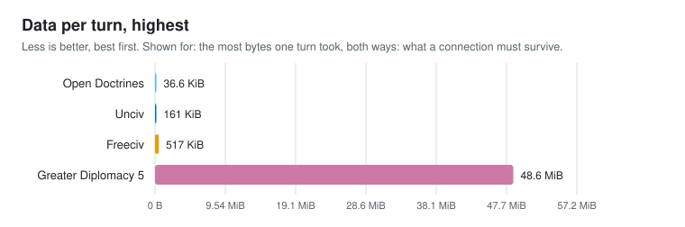

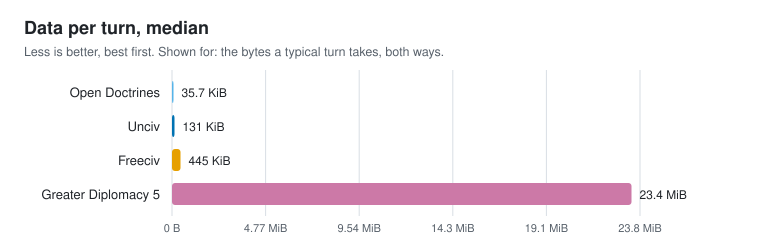

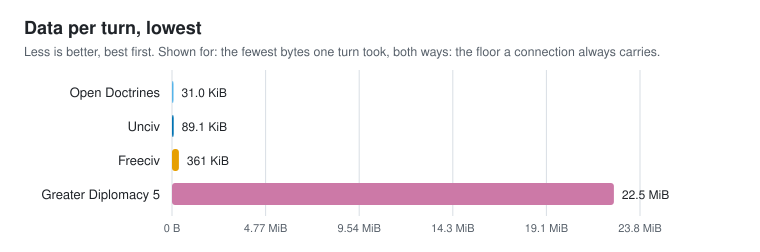

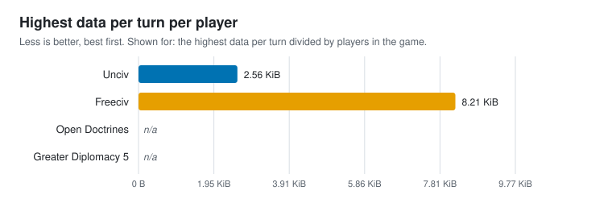

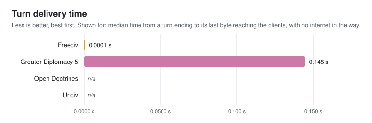

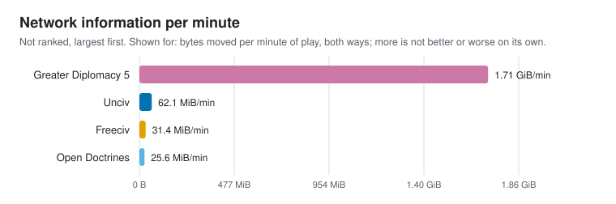

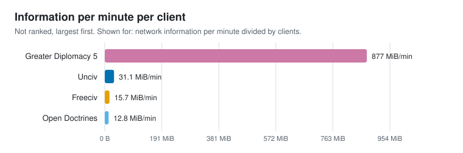

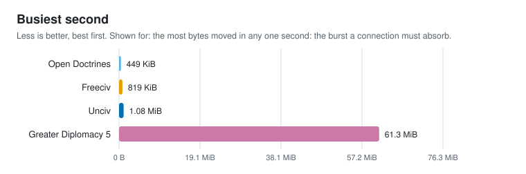

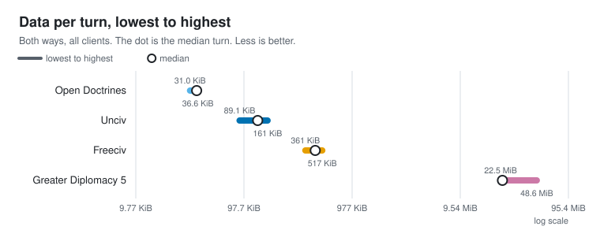

### What each statistic means

- **Data per turn, highest**: the most bytes one turn took, both ways: what a connection must survive. Less is better.
- **Data per turn, median**: the bytes a typical turn takes, both ways. Less is better.
- **Data per turn, lowest**: the fewest bytes one turn took, both ways: the floor a connection always carries. Less is better.
- **Highest data per turn per player**: the highest data per turn divided by players in the game. Less is better.
- **Turn delivery time**: median time from a turn ending to its last byte reaching the clients, with no internet in the way. Less is better.
- **Network information per minute**: bytes moved per minute of play, both ways; more is not better or worse on its own. Not ranked.
- **Information per minute per client**: network information per minute divided by clients. Not ranked.
- **Busiest second**: the most bytes moved in any one second: the burst a connection must absorb. Less is better.

### How each game was measured

- **Open Doctrines**: Open Doctrines' headless eval with OD_OJH_NET: after every turn it packs the same turn delta its multiplayer host broadcasts (Game::mpResolveTurn, SaveManager::packTurn) and reports its size times 2 clients. Joining needs a signed-in account, so no client is on the wire: the bytes are the host's real payload, turn delivery is n/a, and the few bytes of each client's orders are not counted
- **Unciv**: Unciv has no live connection: its multiplayer uploads the whole game after a turn and the other player downloads it. OJH's Unciv driver plays 20 turns with 63 civilizations and reports the size of that compressed game after each one, counted once up and once down; no relay, so turn delivery is n/a
- **Freeciv**: freeciv-server with 63 AI players and 2 freeciv-gtk4 clients on this machine, each attached as a global observer, every byte through OJH's loopback relay; a turn ends at the server's End/start-turn log line
- **Greater Diplomacy 5**: GD5's own real-time server (RealtimeServer and MapRealtimeDriver) hosting the 1939 scenario, with 2 real RealtimeClient guests joining through OJH's loopback relay and submitting every turn; turns end when the server opens the next one

## Footprint

What a player downloads and keeps: install size, and the size and speed of a save.

Not measured for any game yet. Run `ojh footprint <game>` for each game, then build the report again.

## Not measured yet

These measurements have no result file in this folder, so their statistics are n/a above and their score parts are left out.

- **Freeciv**: Footprint (`ojh footprint freeciv`)
- **FreeCol**: Frame rate (`ojh fps freecol`), Network (`ojh net freecol`), Footprint (`ojh footprint freecol`)
- **Greater Diplomacy 5**: Footprint (`ojh footprint gd5`)
- **Open Doctrines**: Footprint (`ojh footprint opendoctrines`)
- **Unciv**: Footprint (`ojh footprint unciv`)

