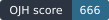

# FreeCol (version 1.2.0): OJH score

**666 points**, OJH score version 2

This score is built from this game's own result files and nothing else. Every part is measured against a fixed reference level, not against other games, so adding, removing or re-running another game never changes it.

## Notes

- scored on 67% of the weight; not reported: Frame rate, Smoothness, Data per turn, Turn delivery

## Parts

| Part | Measured by | Weight | Measured | On the reference CPU | Worth 1,000 points | Points |
|---|---|---|---|---|---|---|
| Turn throughput | ojh tpm | 22% | 643.3 player-turns/min | 387.4 player-turns/min | 2,000 player-turns/min | 255 |
| World throughput | ojh tpm | 13% | 231,577 region-turns/min | 139,445 region-turns/min | 200,000 region-turns/min | 763 |
| Late-game pace | ojh tpm | 8% | 0.09 | same | 0.50 | 231 |
| Steadiness | ojh tpm | 5% | 0.35 | same | 0.50 | 758 |
| Start-up | ojh tpm | 5% | 1.456 s | 2.418 s | 10.0 s | 2,361 |
| CPU per player-turn | ojh tpm | 6% | 0.0983 s | 0.163 s | 0.0100 s | 86 |
| Memory | ojh tpm | 8% | 1.24 GiB | same | 2.00 GiB | 1,388 |
| Frame rate | ojh fps | 12% | not measured | n/a | 60 fps | n/a |
| Smoothness | ojh fps | 8% | not measured | n/a | 30 fps | n/a |
| Data per turn | ojh net | 9% | not measured | n/a | 256 KiB | n/a |
| Turn delivery | ojh net | 4% | not measured | n/a | 0.100 s | n/a |

### What each part measures

- **Turn throughput**: turns per minute times players: how many player-turns the game resolves in a minute.
- **World throughput**: turns per minute times map regions: how much map the game resolves in a minute.
- **Late-game pace**: median early turn time divided by median late turn time: 1 means turns never slow down.
- **Steadiness**: median turn time divided by the 95th percentile: 1 means no turn is slower than usual.
- **Start-up**: seconds from launching the game to its first turn starting. Less is better.
- **CPU per player-turn**: processor time one AI player's turn costs, summed over every core. Less is better.
- **Memory**: the most memory the game held while its turns ran. Less is better.
- **Frame rate**: median of the average frame rate over the map scenes.
- **Smoothness**: the frame rate of the slowest 1% of frames in the game's worst scene.
- **Data per turn**: the most bytes one turn took over the network, both ways. Less is better.
- **Turn delivery**: median time from a turn ending to its last byte reaching the clients. Less is better.

## The runs

- **Game**: FreeCol (version 1.2.0), GPL-2.0, https://www.freecol.org
- **Turn speed**: FreeCol's own "OJH turn" lines, the gaps between them (250 turns timed of 250 turn lines)
- **Turn speed settings**: 250 turns asked for, 250 timed, seed 20260914, players set by the game
- **Machine**: Apple M1 Pro, macOS 26.3 (25D125)
- **CPU reference score**: 1,661 rounds/s on one core; CPU-bound figures were put on OJH's reference CPU (1,000 rounds/s) with a factor of 0.602

## How the score is built

- **Points**: each part scores 1000 × log2(1 + value ÷ reference level): the reference level is worth 1,000 points, three times it 2,000 and seven times it 3,000, and nothing scores below zero. Where less is better, the ratio is turned around.
- **Hardware**: turn speed, start-up, CPU time and turn delivery are put on OJH's reference CPU with the machine's single-core reference score (src/machine.c), so a faster computer does not make a faster game. A game that uses more cores keeps that advantage. Frame rate, memory and data are used as measured.
- **Total**: the weighted mean of the parts the results have. Coverage is how much of the weight that was, here 67%; a part a game was not measured for is left out, never counted as zero.
- **Version**: score version 2. Its parts, weights and reference levels are fixed in src/score.c; any change makes a new version, and scores of different versions are not compared.

